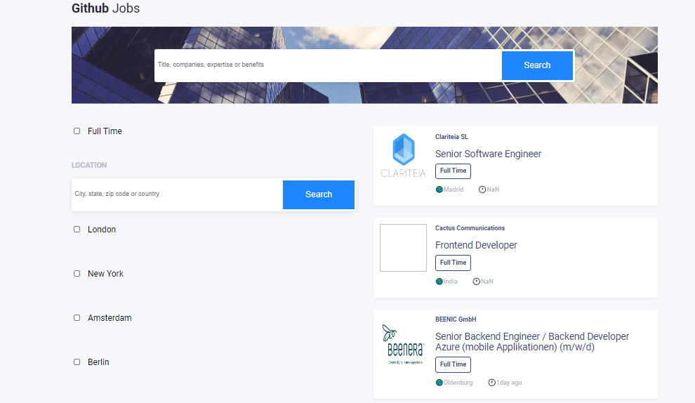
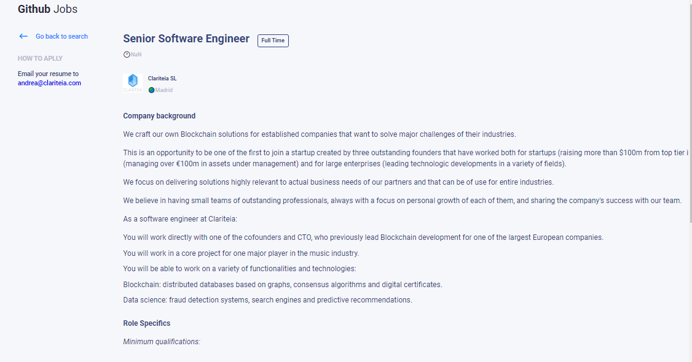

<h1 align="center">Github Jobs</h1>

<div align="center">
  <h3>
    <a href="https://{your-demo-link.your-domain}">
      Demo
    </a>
    <span> | </span>
    <a href="https://{your-url-to-the-solution}">
      Solution
    </a>
  </h3>
</div>

<!-- TABLE OF CONTENTS -->

## Table of Contents

-   [Overview](#overview)
    -   [Built With](#built-with)
-   [Features](#features)
-   [How to use](#how-to-use)
-   [Contact](#contact)
-   [Acknowledgements](#acknowledgements)

<!-- OVERVIEW -->

## Overview





Introduce your projects by taking a screenshot or a gif. Try to tell visitors a story about your project by answering:

- **Where can I see your demo?**

  My demo is stored in my index.html with some scss and the functionalities are ina folder called components which contains all of my component files. Then I have my index.js which renders my react functions, I mean this file is rendering everything to the DOM.

- **What was your experience?**
I hade had both easy and difficult experinces. I worked to paginate sites and filter jobs from github jobs according to location or any other keywords.

-   **In a few sentences, explain the structure of your project.**

  In my code, I ahve a few components that conatines al of my files. I also have two pages, one is the homepage with all job list with fitering forms and the other one is the job detail page which contains any detail job you want to see.

- **If you had more time, what area of your project would you improve?**

If I had more time, I woud improve my scc and also take an adventure buiiding the pagination which the one I couldn't manage any time to finish it.
  And maybe more refactoring for my functionalities

- **Did you learn anything new while working on this project?**

Yes,  I took an adventure in using axios to fetch data from an API which is working fine.
Also, I have learned how to covert an html string into readable markup texts which was really amazing.

This project helped improve my understanding on using different APIs to fetch different data but still keeping the state updated everytime I make changes or fetch any data which was not easy for to handle.

- **What was the most challenging part for you?**
Honestly, creating a good plans was not that easy at the beginning, I also struggled to change the APIs according to any specific attributes that I wanted to include in my API.

-   **Any other comments?**
  Actually, the API we used was so heaby and it took quite a long time to load the data wich made our checking slowly run. And even, I am not sure wether my filtering is working properly or not because it just takes time to check it, and sometimes it is working, sometimes not.


### Built With

<!-- This section should list any major frameworks that you built your project using. Here are a few examples.-->

-   [React](https://reactjs.org/)

## Features
These are few things I used to buid this project:

  - [Sass]()
  - [styled-components]()
  - [jsx]()
  - [html]()
<!-- List the features of your application or follow the template. Don't share the figma file here :) -->

## How To Use

<!-- Example: -->

To clone and run this application, you'll need [Git](https://git-scm.com) and [Node.js](https://nodejs.org/en/download/) (which comes with [npm](http://npmjs.com)) installed on your computer. From your command line:

```bash
# Clone this repository
$ git clone https://github.com/your-user-name/your-project-name

# Install dependencies
$ npm install

# Run the app
$ npm start
```

## Acknowledgements
These site helped me with markup and date  coversion:

- [Markup Conversion](https://stackoverflow.com/questions/37337289/react-js-set-innerhtml-vs-dangerouslysetinnerhtml)
- [Date conversion](https://stackoverflow.com/questions/59089408/how-to-get-weeks-days-hours-minutes-ago-from-custom-date-time-from-now-in)
<!-- This section should list any articles or add-ons/plugins that helps you to complete the project. This is optional but it will help you in the future. For example: -->

## Contact

-   Website [your-website.com](https://{your-web-site-link})
-   GitHub [@yVoninkazo](https://{github.com/Voninkazo})
